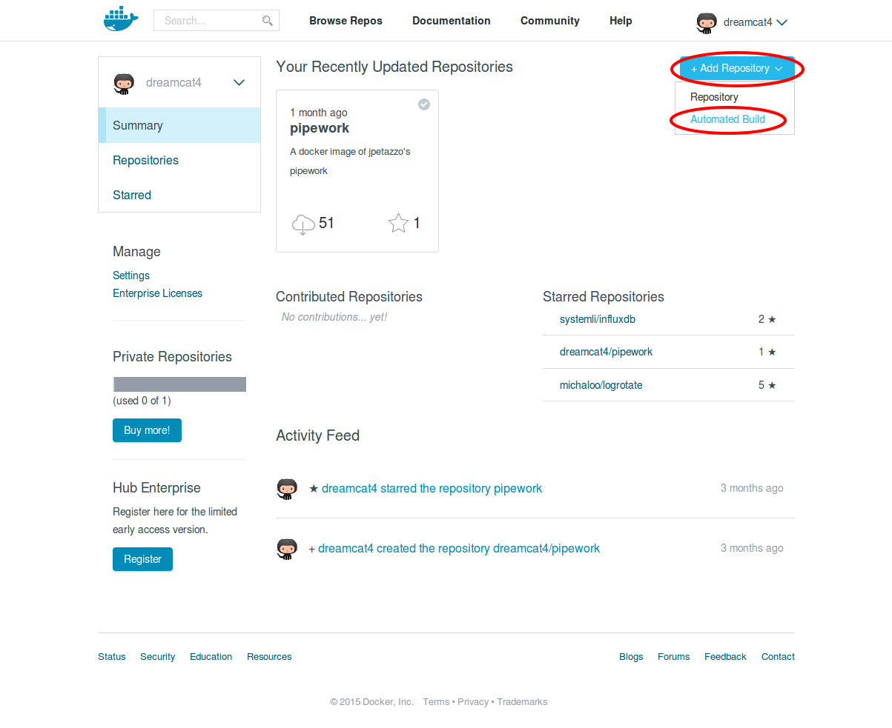
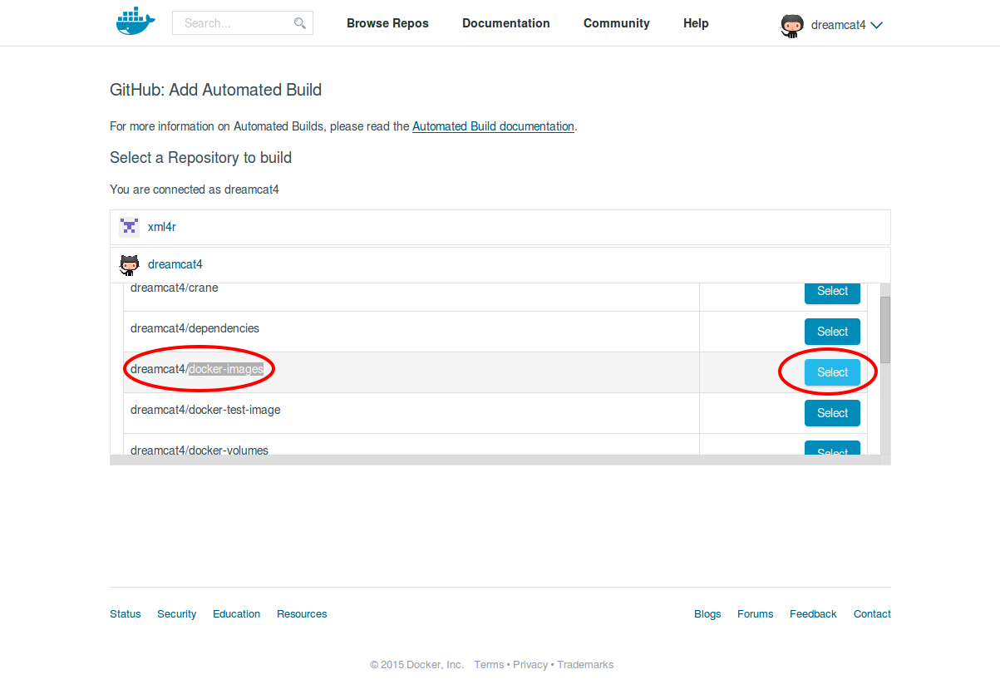
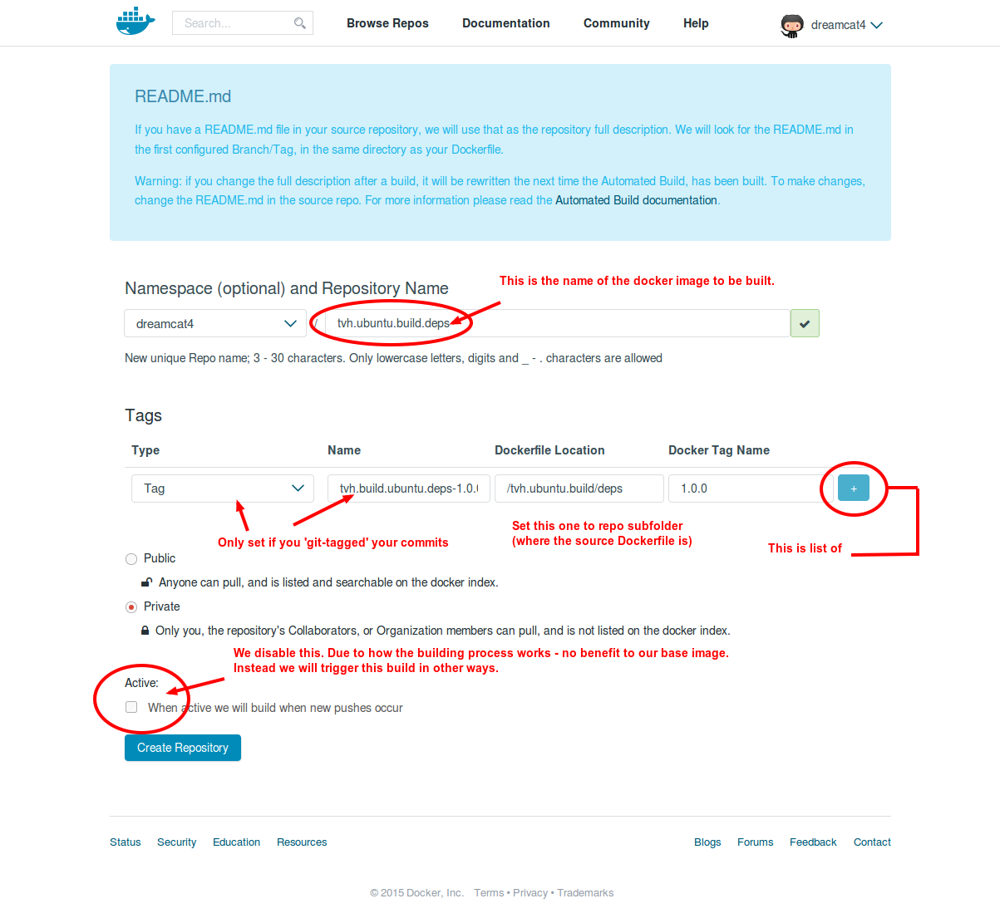
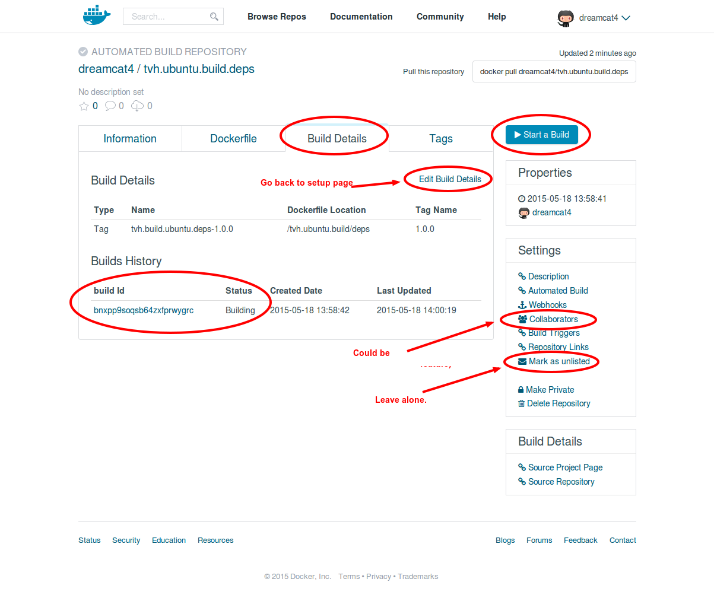
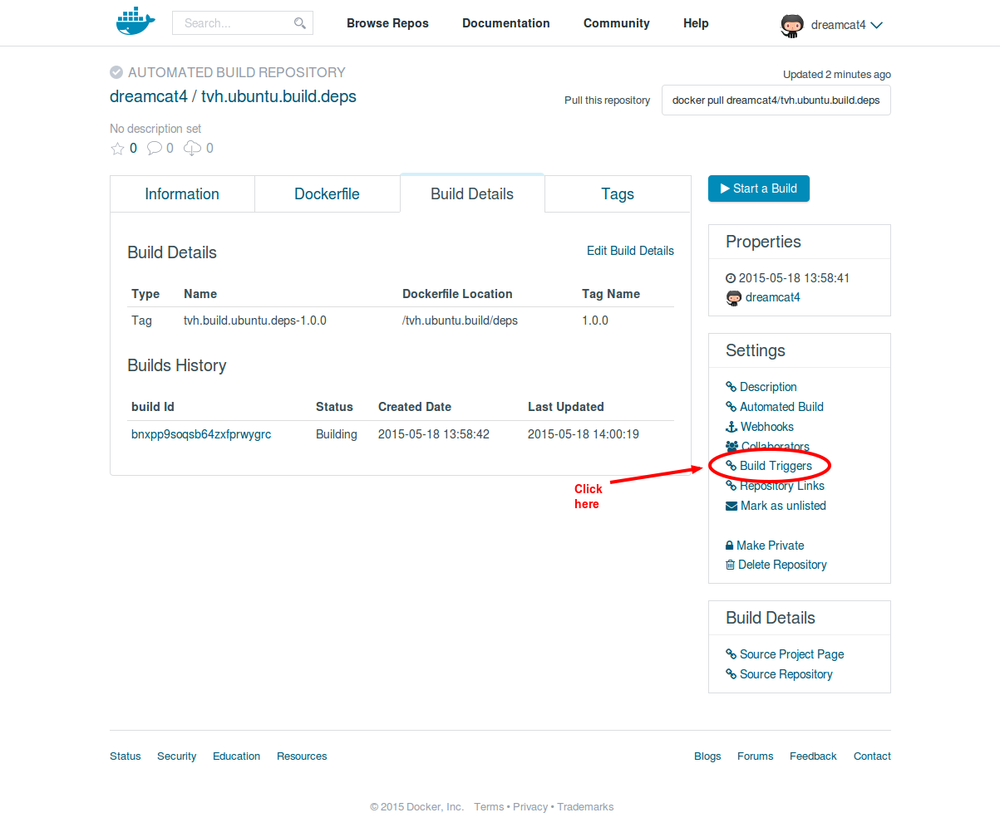
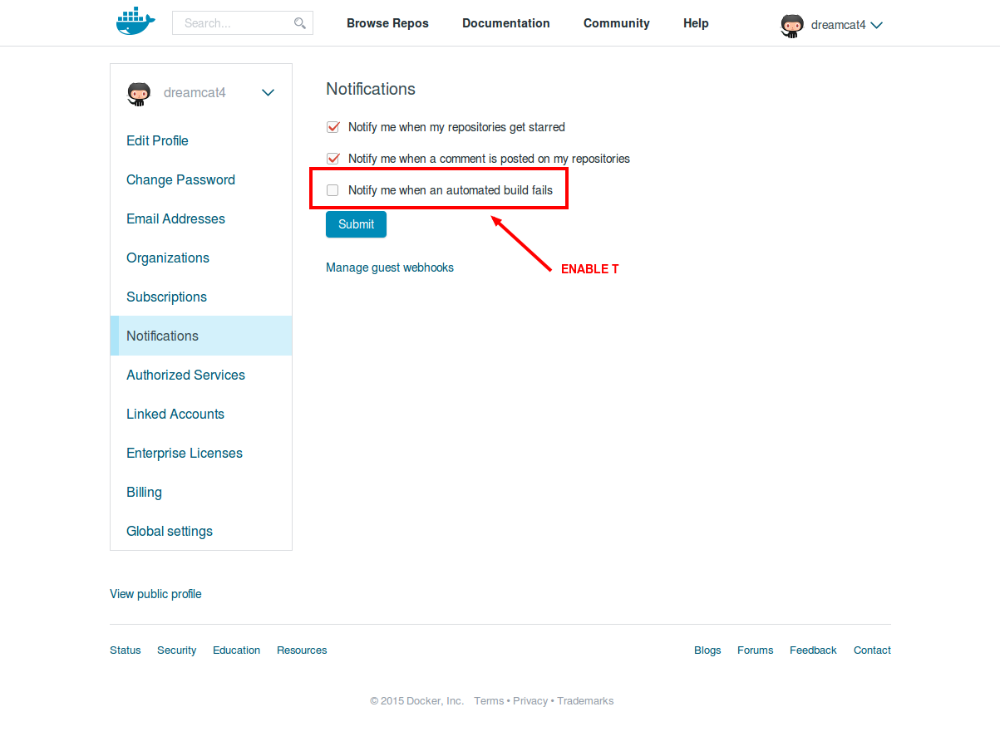

***<div align=right>[`0. Main`](0. maintainers-guide.md)</div>***
**[`Step 1`](1. create-bintray-repos-and-packages.md)** / **[`Step 2`](2. create-tvh.ubuntu.build.deps.md)** / **[`Step 3`](3. create-private-bitbucket-repo.md)** / **[`Step 4`](4. create-private-docker-images.md)**

<!-- START doctoc generated TOC please keep comment here to allow auto update -->
<!-- DON'T EDIT THIS SECTION, INSTEAD RE-RUN doctoc TO UPDATE -->
 

- [Step 2 - build `tvh.ubuntu.build.deps`](#step-2---build-tvhubuntubuilddeps)
  - [Overview](#overview)
  - [Create source repo for Dockerfile](#create-source-repo-for-dockerfile)
  - [Create new docker image on dockerhub](#create-new-docker-image-on-dockerhub)
  - [Schedule a regular re-build](#schedule-a-regular-re-build)
  - [Enable email notification for failed builds](#enable-email-notification-for-failed-builds)

<!-- END doctoc generated TOC please keep comment here to allow auto update -->

## Step 2 - build `tvh.ubuntu.build.deps`

This step is optional.

As things stand, we just use `FROM: dreamcat4/tvh.ubuntu.build.deps` as the first line in the `Dockerfiles` of the tvheadend `.deb` builder images. It points to my own dockerhub build of this common base image. The image is public.

We only need to update this docker image (it's `Dockerfile`) very infrequently. Either to modify the package list in order to add new build dependancies (e.g. newly added HdHomeRun support). Or to remove deprecated or broken ones (e.g. `libiconv`).

To update it, there are 2 choices:

* Option 1: Just open a new issue or submit a pull request to `dreamcat4/docker-images` asking for such modification to be merged on my original repo.

* Option 2: Fork your own copy of `tvh.ubuntu.build.deps` files, modify it, and create your own public Docker hub automated build of `tvh.ubuntu.build.deps`. And setup a weekly or monthly cron job.

Here we document the Option 2:

### Overview

* Create public docker image of tvheadend's build dependancies (optional)
  * On Github
    * Create git repo of build files for the `tvh.ubuntu.build.deps` docker image
  * On Dockerhub
    * Create new public repo named `tvh.ubuntu.build.deps`
      * As automated build
      * Enter your Github Repo
      * Enter the folder path to `tvh.ubuntu.build/deps` subfolder
      * Click the `Start Build` Button
      * Enable build trigger
      * Get build trigger api token
  * On developer PC / server machine (via ssh) as regular user
    * Copy `dh-trigger` curl script & trigger token into local folder
    * Manually test that the script triggers a rebuild over on dockerhub
    * Setup cron job to automatically re-build deps 1x per week OR 1x per month

### Create source repo for Dockerfile

* Login to Github
  * Fork the build files of the `tvh.ubuntu.build.deps` docker image
  * Go to https://github.com/dreamcat4/docker-images and click the 'Fork' button.
  * Or just copy / import the subfolder named `tvh.ubuntu.build` into your own git repo.
  * Edit the file `tvh.ubuntu.build/deps/Dockerfile` to update the build dependancies.
  * Done.

### Create new docker image on dockerhub

* Login to Dockerhub
  * Create new public repo named `tvh.ubuntu.build.deps`
    * As an automated build



* Selected the forked Github Repo where `tvh.ubuntu.build/deps/Dockerfile` now exists. e.g. `yourGithubUsername/docker-images`



* Now enter the details of the build.
  * Most important - set the repo's subfolder path to the Dockerfile. e.g. `tvh.ubuntu.build/deps`
  * Other fields are optional, depending if you have git-tagged the version, etc.
  * AMMEDMENT - The screenshot below shows a tag name of `1.0.0` - that is incorrect. The docker tag (rightmost column should be left as `latest`, which is the default value.



  * Double check the Github repo from earlier for right `Dockerfile` location:


* The initial build should start automatically.
* Else just press the `Start Build` Button.



### Schedule a regular re-build

We do not need to rebuild the apt dependancies as often as tvheadend itself. Just once in a while, for example if ubuntu's ffmpeg version gets updated etc. I recommend a once-weekly or once-monthly build trigger.

We do this by setting up a small cron job on our local (developer) PC. Or any secure server that you have `ssh` login access to. Our cron script must be `chmod 700` as it contains in plaintext our Dockerhub API key. Which is needed for `curl`ing the build trigger rest api (it's just a webhook, like github webooks etc.)

* First we need to enable the build trigger in the dockerhub build setup:




* Now that we know the value for `$trigger_token`, we can log into our development PC or other always-connected server (as a regular user). To set up our cron job that triggers the rebuild every week or every month.

```sh
# Put here your REAL build trigger key, and write it to file
trigger_token="01234567-89ab-cdef-0123-456789abcdef"
dockerhub_repo="tvh.ubuntu.build.deps"

# Create a chmod 600 file and copy your trigger key into it
mkdir -p $HOME/.cron.dockerhub.build/trigger.tokens
install --mode=0600 $HOME/.cron.dockerhub.build/trigger.tokens/${dockerhub_repo}
echo "$trigger_token" > $HOME/.cron.dockerhub.build/trigger.tokens/${dockerhub_repo}


# Download the cron script
mkdir -p $HOME/.cron.dockerhub.build/bin
curl https://raw.githubusercontent.com/dreamcat4/docker-images/master/tvh.ubuntu.build/dh-trigger -o $HOME/.cron.dockerhub.build/bin/dh-trigger


# Manually test that the build trigger works:
# Run 1x & go check dockerhub 'Build details' pages.
# Argumments are your dockerhub username and the dockerhub repo name.
dh-trigger dreamcat4 ${dockerhub_repo}

# Create a cron job
crontab -e
>>>
# 1x per week
# Rebuild at 02:17am every monday morning
17 2 * * 1 dh-trigger dreamcat4 tvh.ubuntu.build.deps

# OR 1x per month:
# Rebuild at 02:17am on the 1st day of every month
17 2 1 * * dh-trigger dreamcat4 tvh.ubuntu.build.deps
<<<
```

### Enable email notification for failed builds

* On dockerhub
  * Go to: https://registry.hub.docker.com/account/notifications/
    * Enable the checkbox:
      * "Notify me when an automated build fails"




