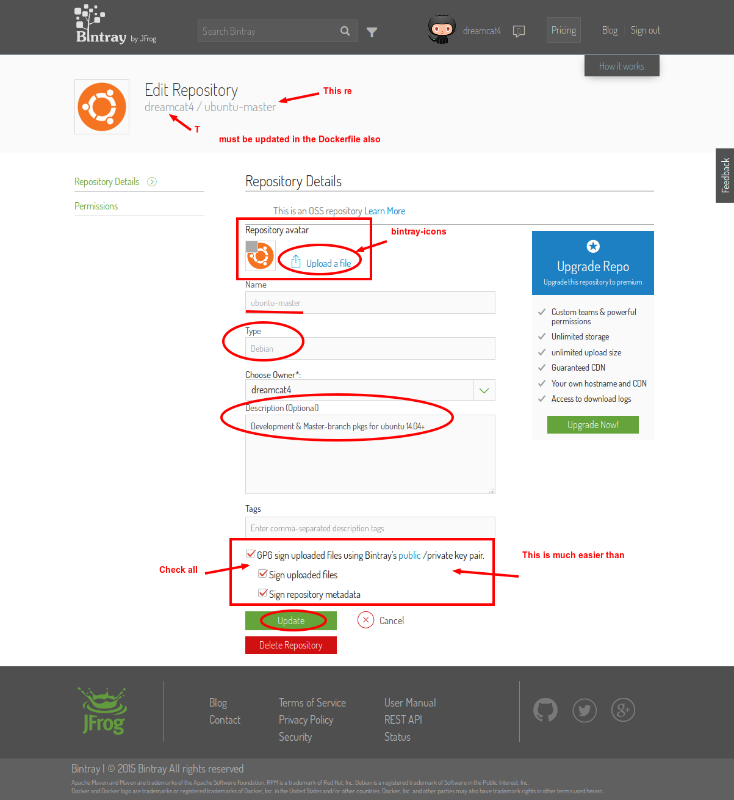
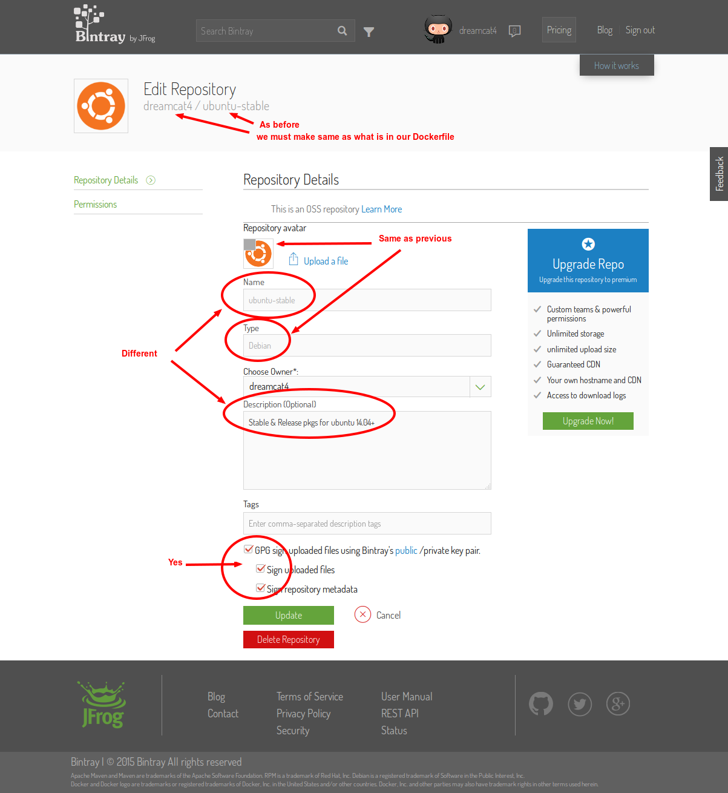
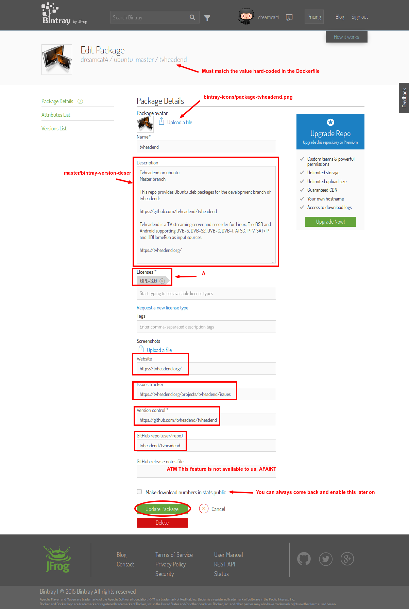

**[`Main Page`](0. maintainers-guide.md)** / **[`Step 1`](1. create-bintray-repo-and-package.md)** / **[`Step 2`](2. create-tvh.ubuntu.build.deps.md)** / **[`Step 3`](3. create-private-bitbucket-repo.md)** / **[`Step 4`](4. create-private-docker-images.md)**

## Step 1 - create bintray repo and package

This step in the setup is pretty simple. It can all be done in a regular web browser, on your account pages at the bintray website.

Be aware that certain fields that you are required to enter must also match values that are hardcoded into the 2 builder `Dockerfile`s.

<!-- START doctoc generated TOC please keep comment here to allow auto update -->
<!-- DON'T EDIT THIS SECTION, INSTEAD RE-RUN doctoc TO UPDATE -->
 

- [Overview](#overview)
- [Create bintray repos (creates 2 ubuntu APT repository)](#create-bintray-repos-creates-2-ubuntu-apt-repository)
- [Create bintray packages for tvheadend](#create-bintray-packages-for-tvheadend)

<!-- END doctoc generated TOC please keep comment here to allow auto update -->

### Overview

* Create bintray repo and package for tvheadend
  * This is where the builder (a docker image) will upload our .deb packages to
* On bintray.com
  * Create 2 new Debian repos, named: `ubuntu-master` and `ubuntu-stable`
    * Copy all the same settings from https://bintray.com/dreamcat4/
  * For each debian repo
    * Create a new 'tvheadend' package
      * Again, copy all the settings from https://bintray.com/dreamcat4/

### Create bintray repos (creates 2 ubuntu APT repository)

* On bintray.com
  * Create 2 new Debian repos, named: `ubuntu-master` and `ubuntu-stable`
    * Copy all the same settings from https://bintray.com/dreamcat4/ e.g.
      * https://bintray.com/dreamcat4/ubuntu-master

  * and https://bintray.com/dreamcat4/ubuntu-stable

### Create bintray packages for tvheadend

  * For each debian repo
    * Create a new 'tvheadend' package
      * Again, copy all the settings from https://bintray.com/dreamcat4/ e.g.
        * https://bintray.com/dreamcat4/ubuntu-master/tvheadend/view

  * and in stable repo too: https://bintray.com/dreamcat4/ubuntu-stable/tvheadend/view

Done.

Now you should have the locations on bintray where we can upload a new "version" of tvheadend to. A bintray "version" is a complete set of the distribution files. e.g. everything that is build from 1 specific git commit.

The 'version' is what our builder image will automatically create each time, and upload the new files to. Those instructions are `curl` api requests at the very end of the 2 `Dockerfile`s (master,stable).

