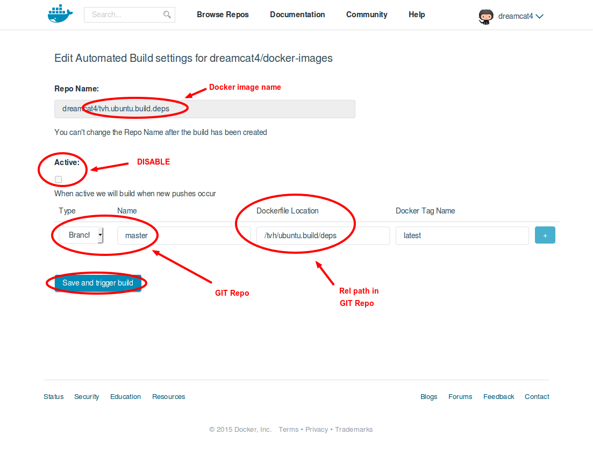
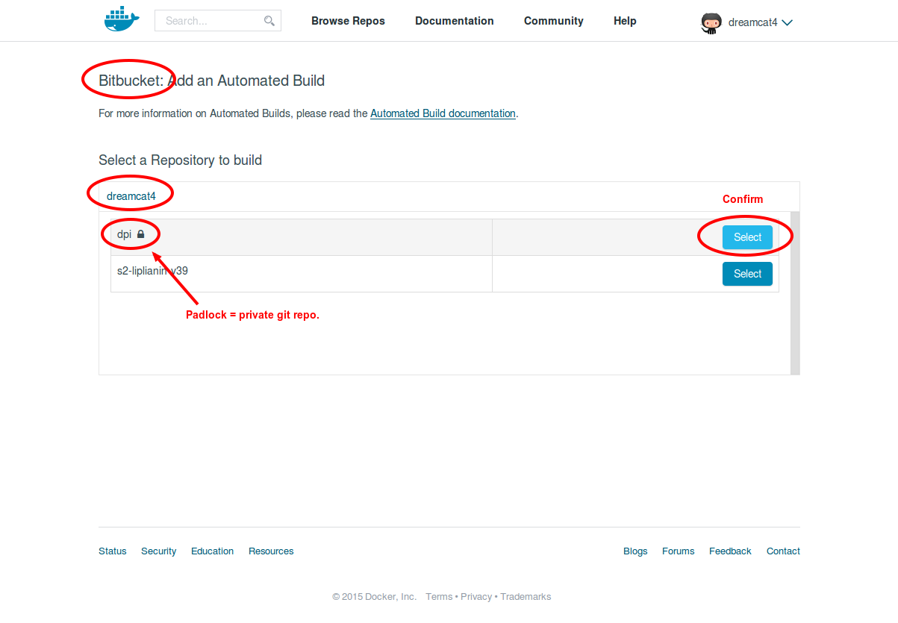
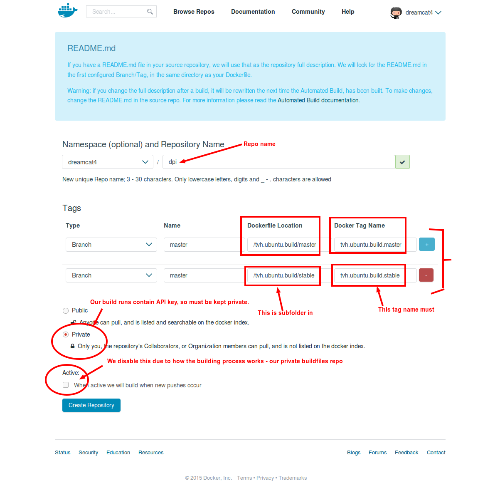
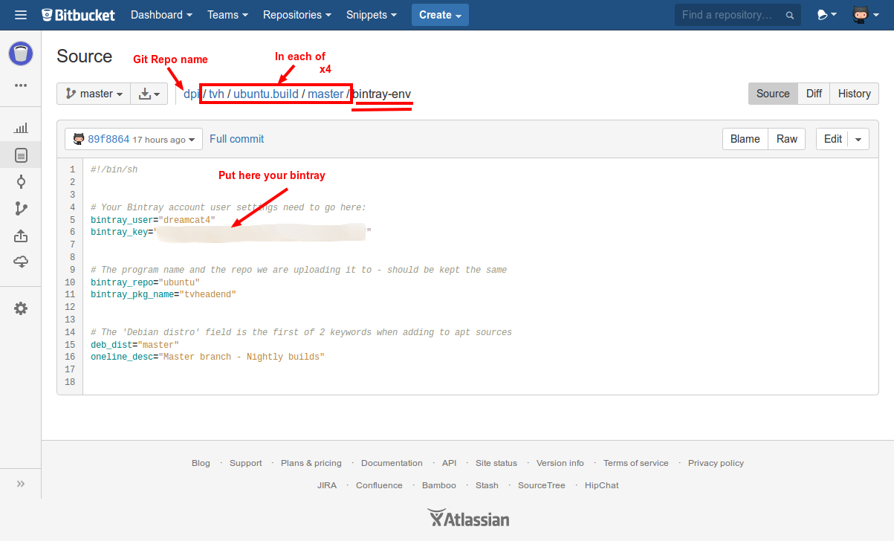
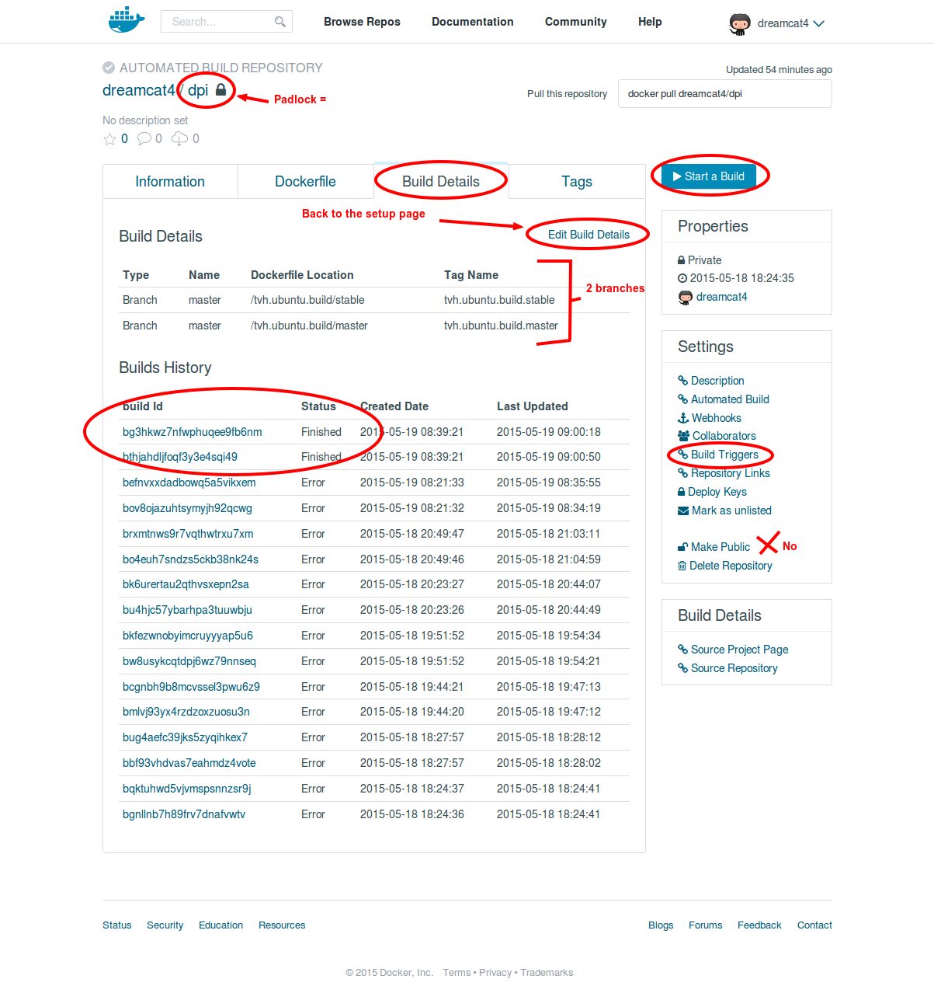

***<div align=right>[`0. Main`](0. maintainers-guide.md)</div>***
**[`Step 1`](1. create-bintray-repo-and-package.md)** / **[`Step 2`](2. create-tvh.ubuntu.build.deps.md)** / **[`Step 3`](3. create-private-bitbucket-repo.md)** / **[`Step 4`](4. create-private-docker-images.md)**

## Step 4 - create private docker images

This is where we create the docker images that actually build tvheadend. Same image uploads those files to bintray.com.

<!-- START doctoc generated TOC please keep comment here to allow auto update -->
<!-- DON'T EDIT THIS SECTION, INSTEAD RE-RUN doctoc TO UPDATE -->
 

- [Overview](#overview)
- [Create new docker image on dockerhub](#create-new-docker-image-on-dockerhub)
- [Schedule a regular re-build](#schedule-a-regular-re-build)
- [Enable email notification for failed builds](#enable-email-notification-for-failed-builds)

<!-- END doctoc generated TOC please keep comment here to allow auto update -->

### Overview

* Create private docker images to build the tvheadend APT packages for ubuntu
  * First create your 1 free private docker hub repo (you are only allowed 1)
    * Call it `dpi` - for 'Dockerhub Private Images' or something like that.
  * Create new Docker tag named `tvh.build.ubuntu.master` --> builds docker image `tvh/build.ubuntu.master`
    * Point it to your bitbucket private repo
  * Repeat the previous step for each of the 4 build folders: `master`, `unstable`, `testing` and `stable`.

### Create new docker image on dockerhub

* Login to Dockerhub
  * Create new public repo named `dpi`, which is short for 'Docker Private Images'
  * We are only allowed 1 *private* repo for each dockerhub account.
    * As an automated build



* Select our private Bitbucket Repo in the list. E.g. `yourBitbucketUsername/dpi`. This is where we have the private copy of our build folders e.g. `tvh/ubuntu.build/master/` including our private bintray API key in the files of `bintray-env` within each subfolder.



* Now enter the details of the build.
  * Most important - set the repo's subfolder path to the Dockerfile. e.g. `/tvh/ubuntu.build/master`
  * Repeat the previous step for each of the 4 build folders: `master`, `unstable`, `testing` and `stable`.



  * Double check the Bitbucket repo from earlier for right `Dockerfile` location:



* The initial build should start automatically.
* Else just press the `Start Build` Button.



### Schedule a regular re-build

We do not need to rebuild the apt dependancies as often as tvheadend itself. Just once in a while, for example if ubuntu's ffmpeg version gets updated etc. I recommend a once-weekly or once-monthly build trigger.

We do this by setting up a small cron job on our local (developer) PC. Or any secure server that you have `ssh` login access to. Our cron script must be `chmod 700` as it contains in plaintext our Dockerhub API key. Which is needed for `curl`ing the build trigger rest api (it's just a webhook, like github webooks etc.)

* First we need to enable the build trigger in the dockerhub build setup:


* Now that we know the value for `$trigger_token`, we can log into our development PC or other always-connected server (as a regular user). To set up our cron job that triggers the rebuild every week or every month.

* Install the [`dh-trigger`](https://github.com/dreamcat4/docker-images/tree/master/tvh/ubuntu.build/dh-trigger) cmd:

```sh
# Choose a location on your $PATH where to save the 'dh-trigger' script
mkdir -p $HOME/.bin

# Download the dh-trigger cmd with wget or curl
wget -O $HOME/.bin/dh-trigger https://raw.githubusercontent.com/dreamcat4/docker-images/master/tvh/ubuntu.build/dh-trigger/dh-trigger || \
curl https://raw.githubusercontent.com/dreamcat4/docker-images/master/tvh/ubuntu.build/dh-trigger/dh-trigger -o $HOME/.bin/dh-trigger

# Make executable
chmod +x $HOME/.bin/dh-trigger

# Add the bin/ folder to your $PATH if not already
echo "PATH=\"\$PATH:$HOME/.bin\"" >> ~/.profile
echo "PATH=\"\$PATH:$HOME/.bin\"" >> ~/.bashrc
```

* Get your trigger token from dockerhub config pages ('build triggers' link). Then add it like this:

```sh
# Put here your REAL build trigger key, and write it to file
trigger_token="YOUR-IMAGE's-TRIGGER-TOKEN"

# Save your trigger key to a chmod 600 file in the ~/.dh-trigger/ folder
dh-trigger add "dreamcat4/dpi" "$trigger_token"
```

* Manually test that the build trigger works. Run this command & go check the dockerhub 'Build details' page:

```sh
dh-trigger all dreamcat4/dpi
```

* Create a cron job for this specific trigger:

We need to specify 2 similar cron lines because of a technical issue regarding daylight savings time.

```sh
# Add a new cron job line to fire off your chosen trigger command
crontab -e    # or 'cru' on some machines
>>>
# tvheadend .deb pkgs - Rebuild at 01:15am UTC every morning
15 01 * * * [ "$(date +%z)" = "+0000" ] && $HOME/.bin/dh-trigger all dreamcat4/dpi
15 02 * * * [ "$(date +%z)" = "+0100" ] && $HOME/.bin/dh-trigger all dreamcat4/dpi
<<<
```

The trigger command `all` will trigger all the `tags` (branches) of your repo simultaneously. However you may not wish for every one of them to be re-build every time. Then use one of the other trigger commands `dh-trigger --help` for more information.

*It is necessary to make 2 cron lines for each command, as is shown above. To ensure the job will always execute on `UTC` time, irrespective of the 1 hour seasonal shift of your local daylight savings time. This is because even between machines within the same timezone, their can be a number of days when their local offsets are out of sync. Specifically, when one or more of those systems are based on busybox or ulibc. Then the seasonal change date has always been hardcoded and is never guaranteed to be consistent.*

***Build Schedule Timings:***

You must allow / give reasonable amount of time **before** building this image, so that if it is a monday, the deps (dependancies) image can finish building first of all. If you check your other cron job, the suggest build start time for the public deps build was `00.15am UTC` so here ^^ we specified `01.15am UTC`. As the build tim may be approximately half an hour - we double that value to make sure. In case some days slow-down or longer build queues.

***2nd example:***

If your regular time is `+0500` shift of `UTC`, and your seasonal time is `+0600` shift of `UTC`. Then add `+5` to all of the hours specified in above example. This means being run at `06:15am` and `07:15am` of your local time respectively. So your modified cron lines would then look like this:

```sh
# Add a new cron job line to fire off your chosen trigger command
crontab -e    # or 'cru' on some machines
>>>
# tvheadend .deb pkgs - Rebuild at 01:15am UTC every morning
15 06 * * * [ "$(date +%z)" = "+0500" ] && $HOME/.bin/dh-trigger all dreamcat4/dpi
15 07 * * * [ "$(date +%z)" = "+0600" ] && $HOME/.bin/dh-trigger all dreamcat4/dpi
<<<
```

***Cron job redundancy:***

But what if your computer does down or has technical problems? Then the scheduled build job will fail to get triggered.

Well since we have solved the time zone problem, we can just repeat the same steps above on other machines. And the same set of cron job(s) will trigger at the same times. Dockerhub will ignore any duplicate build requests. *So long as they are all made within the same 5 minute window. Therefore, in addition to the timezone fix, be sure also that the system time on every machine is being kept in sync with ntpd. Otherwise there is likely to be a significant amount of clock drift.*

### Enable email notification for failed builds

* On dockerhub
  * Go to: https://registry.hub.docker.com/account/notifications/
    * Enable the checkbox:
      * "Notify me when an automated build fails"


